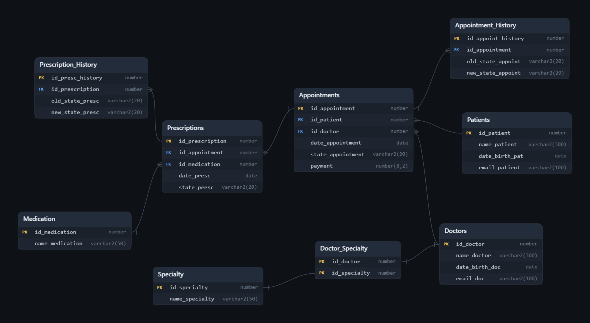

# 🏥 Healthcare Database Manager

A personal project that simulates, on a simple level, a working database for a fictional healthcare clinic.

The project focuses on **relational database design, SQL, SQLite and Oracle**, including tables, relationships, constraints, views, indexes, procedures and triggers.

This project was created as a hands-on learning project to deepen my understanding of relational databases and Oracle, while building something that can be expanded with additional functionality over time.

It also serves as a practical demonstration of database concepts applied to a realistic, although simplified, business scenario.

---

## 📌 Project Overview

The database manages:

* 👤 Patients
* 👨‍⚕️ Doctors
* 🩺 Medical specialties
* 📅 Appointments
* 💊 Medications
* 📋 Prescriptions
* 🔄 Appointment & prescription history

The project is implemented in **both SQLite and Oracle**, using the same underlying relational model, while taking advantage of database-specific features where appropriate.

The relational model is already fully normalized up to 3NF.

The Oracle version uses the same relational model as the SQLite version, only with different variable names and additional Oracle-specific functionality such as:

* Stored Procedures
* Triggers
* Oracle Identity Columns
* Oracle-specific data types

### Database ER Diagram



---

# 🗄️ SQLite Version

### Requirements

You will need:

* SQLite / DB Browser for SQLite
* This repository

### ⚙️ Setup

**1. Download SQLite**

Download the appropriate version for your operating system from the official SQLite website:

👉 https://www.sqlite.org/download.html

**2. Download and extract this repository**

```bash
git clone git@github.com:tito-pereira/Healthcare-Database-Manager.git
cd Healthcare-Database-Manager
```

**3. Open SQLite**

Open your SQLite database management software and go to:

```text
Execute SQL
```

**4. Open the project SQL files**

Open the following files:

```text
01_tables_sqlite.sql
02_seed_sqlite.sql
03_views_sqlite.sql
04_testing_sqlite.sql
```

**5. Create a new database**

Create a new SQLite database and give it any name you want.

**6. Run the scripts in the following order**

```text
01_tables_sqlite.sql
        ↓
02_seed_sqlite.sql
        ↓
03_views_sqlite.sql
        ↓
04_testing_sqlite.sql
```

> ⚠️ The order is important because later scripts depend on objects created by the previous ones.

### 🔎 Exploring the database

After running the first three scripts, you can explore the database through:

```text
Database Structure
        │
        ├── Tables
        ├── Views
        └── Indexes

Browse Data
        │
        └── Table contents

Execute SQL
        │
        └── Custom queries / tests
```

The file `04_testing_sqlite.sql` contains pre-made queries to test the database.

---

# 🏢 Oracle Version

### Requirements

You will need:

* Oracle SQL Developer
* Oracle Database
* This repository

### ⚙️ Setup

**1. Download Oracle SQL Developer**

Download, extract and set up the appropriate Oracle SQL Developer version for your machine from the official SQLite website:

👉 [https://www.oracle.com/database/sqldeveloper](https://www.oracle.com/database/sqldeveloper)

**2. Download Oracle SQL Developer**

Download, extract and set up the appropriate Oracle Database version for your machine from the official SQLite website:

👉 [https://www.oracle.com/database/technologies/oracle-database-software-downloads.html](https://www.oracle.com/database/technologies/oracle-database-software-downloads.html)

**3. Download and extract this repository**

```bash
git clone git@github.com:tito-pereira/Healthcare-Database-Manager.git
cd Healthcare-Database-Manager
```

**4. Setup the Oracle Database**

Set up Oracle Database using `FREEPDB1` as the Pluggable Database (PDB) and choose a password of your liking;

**5. Login as SYSTEM**

Log into `FREEPDB1` as user `SYSTEM`, using the password you have chosen.
Make sure to select `Service Name` rather than `SID`, with `FREEPDB1` as the service name;

**6. Edit the setup script**

Open and edit the file `00_systemsetup_oracle.sql` to choose the password for the `HEALTHCARE` user. Change the password on the line that says:

```text
CREATE USER HEALTHCARE
IDENTIFIED BY "Your_Password";
```

**7. Run the setup**

Run `00_systemsetup_oracle.sql` while logged in as the `SYSTEM` user to create and setup the `HEALTHCARE` user;

**8. Login as the HEALTHCARE user**

Log into `FREEPDB1` as the `HEALTHCARE` user, using the password you chose in `00_systemsetup_oracle.sql`. Again, select `Service Name` and use `FREEPDB1`;

**9. Open the script files**

Open the following files:
```text
01_tables_oracle.sql
02_seed_oracle.sql
03_views_oracle.sql
04_procedures_oracle.sql
05_triggers_oracle.sql
```

**10. Run the scripts**

Run the scripts in the following order:
```text
01_tables_oracle.sql
        ↓
02_seed_oracle.sql
        ↓
03_views_oracle.sql
        ↓
04_procedures_oracle.sql
        ↓
05_triggers_oracle.sql
```

Your Healthcare Database Manager Oracle database is now ready to use. You can explore the tables, data, views, procedures and triggers through Oracle SQL Developer.

> ⚠️ The order is important because later scripts depend on objects created by the previous ones.

---

# 🛠️ Technologies

| Technology         | Purpose                            |
| -------------      | ---------------------------------- |
| SQL                | Database querying and manipulation |
| SQLite             | Lightweight relational database    |
| Oracle             | Enterprise relational database     |
| SQL Developer      | Oracle database management         |
| Git / GitHub       | Version control                    |
| SQL to ER Diagram  | Diagram Visualization              |

---

# 📚 Concepts Demonstrated

### Database Design

* Relational modelling
* Primary keys
* Foreign keys
* Composite primary keys
* Constraints
* Many-to-many relationships
* Normalization

### SQL

* `SELECT`
* `INSERT`
* `UPDATE`
* `DELETE`
* `JOIN`
* `GROUP BY`
* `SUM`
* `AVG`
* `ORDER BY`
* Aggregate functions

### Database Objects

* Tables
* Views
* Indexes
* Stored Procedures
* Triggers
* History / audit tables

